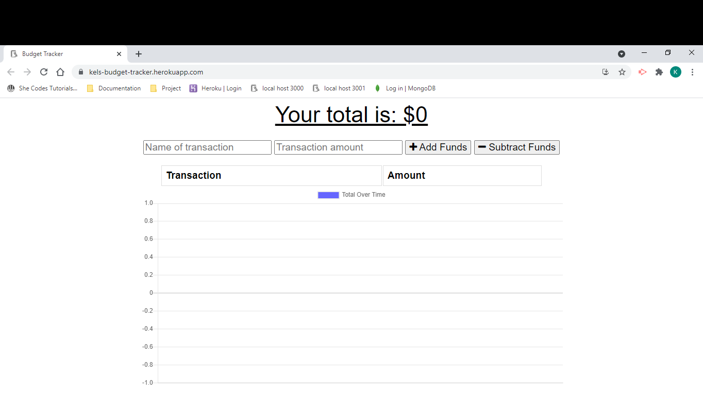
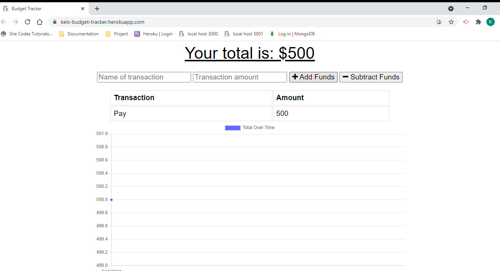
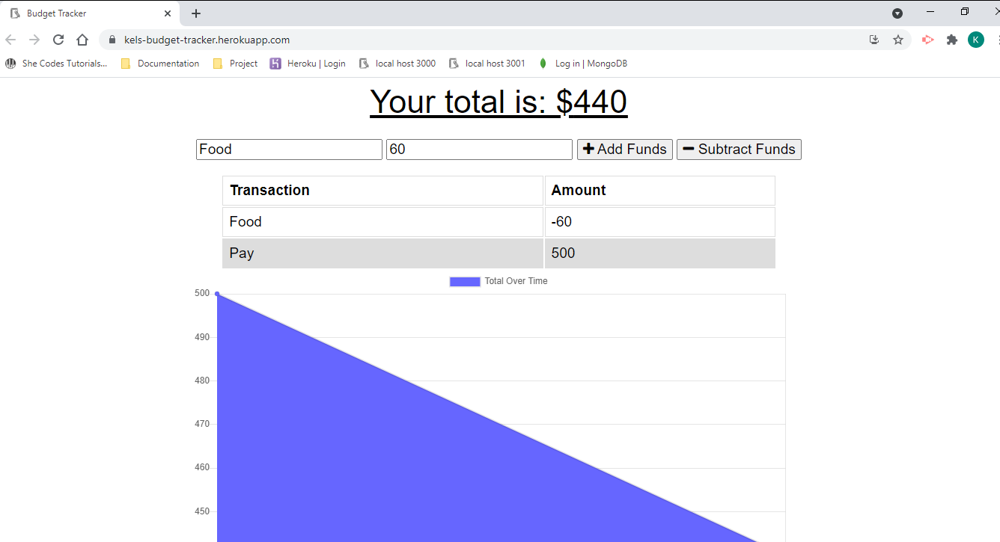

# Kel's Budget Tracker

## Table of Contents

- [Description](#description)
- [Usage](#usage)
- [Links](#links)
- [Screenshots](#screenshots)

## Description

Track your Budget even with no internet. You can add or subtract from your funds with a click of a button and also view your current total. When you connect online your budget will update with any transactions you entered while offline.

This App uses:
- MongoDB
- Mongoose
- Express.JS
- Node.JS

## Usage

* click on the "Deployed Website" link. No need to be online either!
* click on "add Funds" to add a deposit/funds
* click on "subtract Funds" to add an expense

## Links

* gitHub: https://github.com/Kel03-byte/budget-tracker
* Deployed website: https://kels-budget-tracker.herokuapp.com/

## Screenshots

Homepage

Add A Deposit

Add An Expense
